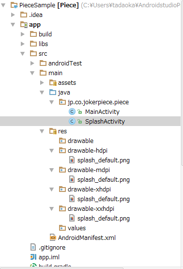

# スプラッシュ画面の設定手順

### SplashActivityの作成
ライブラリのSplashBaseActivityを継承することでSplashActivityを作成する。
実装するにあたって、以下の3点に注意する。

1. onCreate内でsuper.onCreateメソッドを呼ぶ。
2. getTransitionClassメソッドをoverrideし、SplashActivityから遷移するActivityのクラス名を返す。
3. SplashActivity.javaの記述例を以下に示す。

SplashActivity.java

    package jp.co.jokerpiece.piece;
    
    import android.os.Bundle;
    
    import jp.co.jokerpiece.piecebase.SplashBaseActivity;
    
    public class SplashActivity extends SplashBaseActivity {
        @Override
        protected void onCreate(Bundle savedInstanceState) {
            super.onCreate(savedInstanceState);
        }
    
        @Override
        public Class<?> getTransitionClass() {
            return MainActivity.class;
        }
    }

### AndroidManifestの設定
設定するにあたって、以下の4点に注意する。

1. SplashActivityをランチャーアクティビティとして記述する。
2. SplashActivityのthemeでNoTitleBarの設定を記述する。
3. MainActivityをアクティビティとして記述する。
4. AndroidManifest.xmlの記述例を以下に示す。

AndroidManifest.xml(抜粋)

    <activity
        android:name=".SplashActivity"
        android:theme="@android:style/Theme.Light.NoTitleBar"
        android:screenOrientation="portrait">
        <intent-filter>
            <action android:name="android.intent.action.MAIN" />
            <category android:name="android.intent.category.LAUNCHER" />
        </intent-filter>
    </activity>
    <activity
        android:name=".MainActivity"
        android:screenOrientation="portrait" />

### 画像の設定
ライブラリ側でデフォルト画像を設定しているため、アプリ側で画像を上書きする必要がある。
ファイル名は「splash_default.png」で設定する。
画像は、リソースのdrawable-hdpi, drawable-mdpi, drawable-ldpi, drawable-xhdpi, drawable-xxhdpiフォルダすべてに
コピーする必要があります。

### フォルダ構成の例
フォルダ構成の例を以下に示す。

